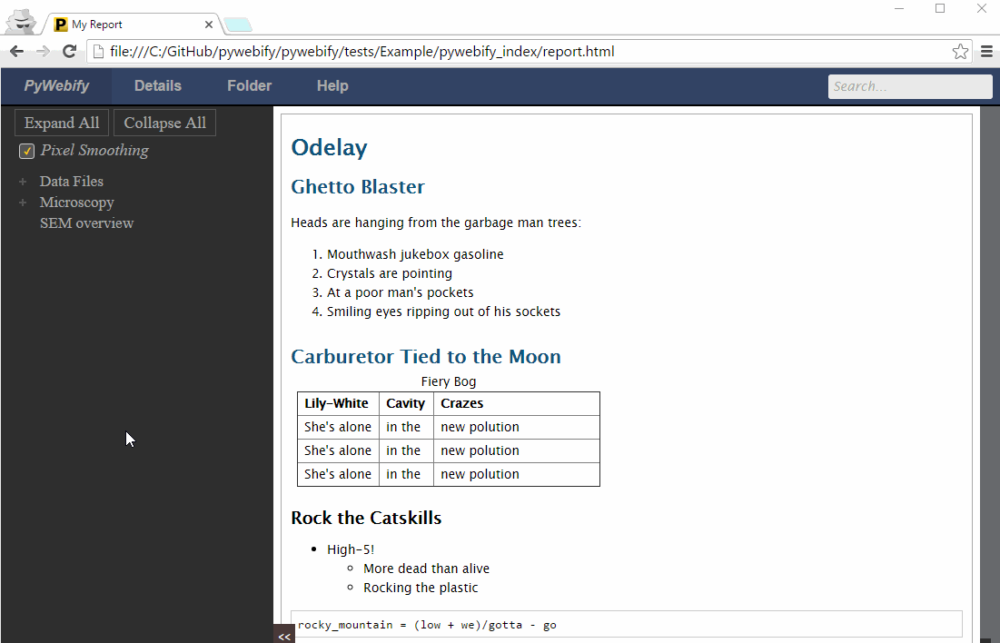

.. PyWebify documentation master file, created by
   sphinx-quickstart on Fri Oct 16 10:58:17 2015.
   You can adapt this file completely to your liking, but it should at least
   contain the root `toctree` directive.

PyWebify:  Rapid Browser-Based Report Visualization
===================================================

PyWebify is a simple, open-source, web-based data report builder.  It takes an
existing folder structure containing images, plots, tables, and fully-featured
html files into a customizable, easily-navigable, and searchable
html report.  Unlike Powerpoint presentations or written reports which must be
created manually and are inherently limited in the number of details that can
be presented before the document becomes intractable, PyWebify reports are
created with as little as a single Python command and can contain an unlimited
amount of nested information, in order to allow the reader to drill down further
into nitty-gritty details only if necessary.

User Guide Contents:
====================

.. toctree::
   :maxdepth: 1

   install
   launch
   overview
   config

Indices and tables
==================

* :ref:`genindex`
* :ref:`modindex`
* :ref:`search`

